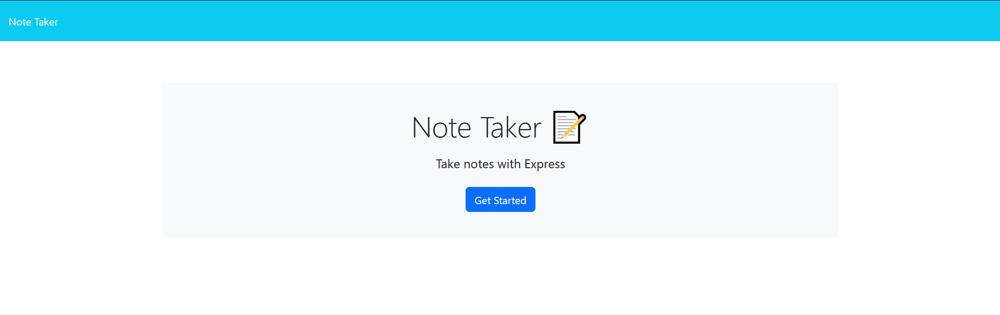
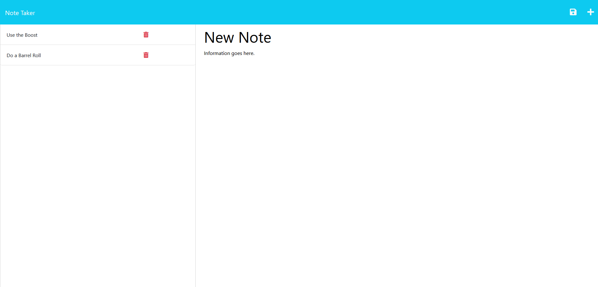

# express-note-taker

## Description
A simple note taking application that utilizes Express JS.

## Table of Contents

- [Installation](#installation)
- [Usage](#usage)
- [Tests](#tests)
- [Credits](#credits)
- [License](#license)
- [Questions](#questions)

## Installation
You may need to install the following packages...

Run "npm install" with node to install needed module packages. ('express' and 'uniqid')

## Usage
Link to Application: https://mighty-citadel-05037.herokuapp.com/

After installing necessary modules, you can start the server using "npm start". It will open at http://localhost:3001. The application can also be accessed through a deployed link. (Listed above)

Click on "Get Started" to go to the Notes page. Enter a Title and necessary information in the Text Field. Click the Save Icon at the top (Will not appear if nothing is filled out).

Delete notes by clicking the red Trash Can icon.

Notes saved through the deployed Heroku website. Will be saved and seen globally to whoever accesses the website. If the application is ran locally (through http://localhost:3001), then the notes will save and persist on that machine.

## Tests
none

## Credits
- [AnthonyFrederick7](https://github.com/AnthonyFrederick7)
- [Bucket12](https://github.com/Bucket12)
- [Christoph551](https://github.com/Christoph551)
- [AdamHovda](https://github.com/adamhovda)

- [Starter Code](https://github.com/coding-boot-camp/miniature-eureka)

## Questions?

- Github: https://github.com/jminor90

- Email: minor.jbm@gmail.com

